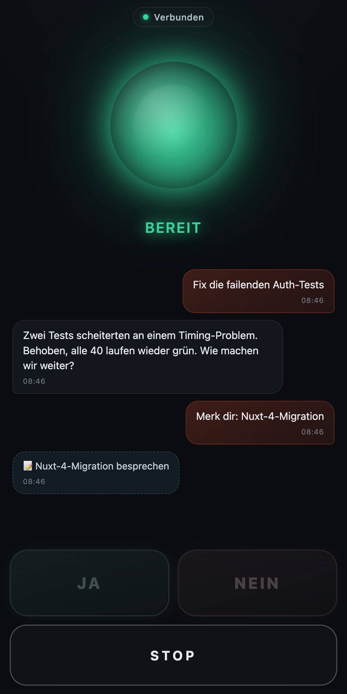
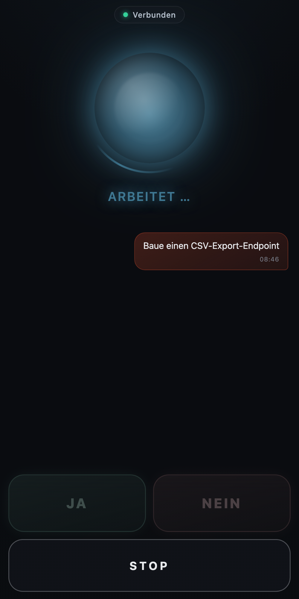
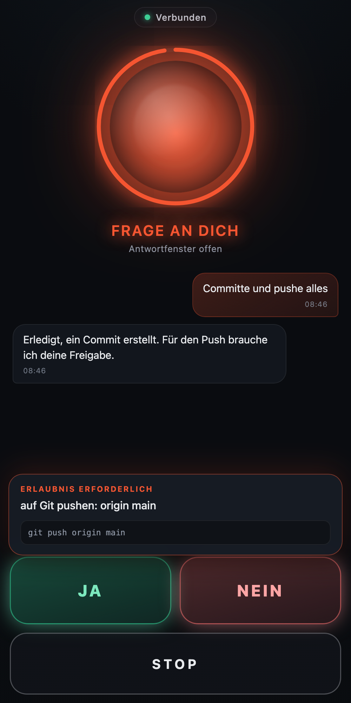

# Claude-to-go (`c2g`)

**🇬🇧 English** · [🇩🇪 Deutsch](README.de.md)

> Hands-free coding with Claude Code — while driving, walking, working out, or
> commuting. Any time your hands are busy.

You say "Claude, fix the failing tests", Claude works in your project and reads
a short answer back to you. Always-on microphone with a wake word, local speech
recognition (offline, dead-zone-proof), and risky actions like `git push` are
approved by voice. Optionally control everything from your iPhone — answers
then route through CarPlay to the car speakers.

<p align="center">
  
  
  
</p>
<p align="center"><sub>iPhone frontend: ready · working · yes/no permission prompt</sub></p>

## How it works

c2g is a thin voice layer **on top of your normal Claude Code session** — no
API access, no second model. It spawns your locally installed `claude` binary
via the official Claude Agent SDK with **your subscription login**: same
engine, same `CLAUDE.md` rules and skills as in the terminal.

> **Personal single-user only.** Your account and token stay with you — never
> share them or run this for third parties. Every user logs in with their own
> Claude subscription.

## Install

```bash
uv tool install "git+https://github.com/alpamayo-solutions/claude2go"
```

**Requirements:** macOS · [Claude Code](https://claude.com/claude-code) with
your own subscription (`claude login`) · [`uv`](https://docs.astral.sh/uv/).

Then run this **once at your desk** — it triggers the macOS microphone
permission dialog, downloads the speech-recognition model, and checks the
whole chain:

```bash
c2g doctor
```

## Getting started

```bash
cd ~/projects/my-project
c2g
```

Claude greets you; then say **"Claude, …"** followed by your request. Quit
with `q` + Enter or Ctrl+C.

| Command | Purpose |
|---|---|
| `c2g` | voice mode in the current project |
| `c2g --continue` | continue the last conversation (with a spoken recap) |
| `c2g --resume [ID]` | resume a specific session (without ID: most recent in the directory) |
| `c2g --phone` | iPhone as mic & speaker (see below) |
| `c2g --typed` | type instead of speak, output still spoken (for testing) |
| `c2g --send "..."` | one message, one answer, exit (for scripts) |
| `c2g --lang de\|en` | interaction language for this run |
| `c2g --model opus` | use a different model |
| `c2g doctor` | verify the setup once |

## Language

German is the default; English is fully supported — wake vocabulary, spoken
phrases, speech recognition, and voice all switch together.

Set it per run with `--lang en`, or enforce it persistently in
`~/.c2g/config.toml`:

```toml
language = "en"
```

Precedence is always **CLI flag > settings file > built-in default**. Other
preferences can be pinned there too, e.g. `voice`, `speech_rate`,
`whisper_model`, `mic_device`, `model`.

## Hands-free voice controls

**Talking:**

- **"Claude, …"** — a request or a thought (also "Hey Claude …"). A quiet
  **tick** confirms "heard", the **hero chime** means "on it".
- After every answer the mic stays **open for 20 seconds** — reply directly,
  no wake word needed (glass sound = open, bottle sound = closed). Speak just
  after it closes and it asks: *"Did you mean me?"*
- **Just talk over Claude while it works** — interjections flow into the
  running task and are answered immediately.

**Commands** (English / German trigger words where they differ):

- **"Claude, stop"** / *"Claude, stopp"* — cancels speech output and the
  current work, even mid-sentence (voice barge-in).
- **"Claude, status"** — whether and how long it has been working.
- **"Claude, note …"** / *"Claude, merk dir …"* — flash note to the notes
  file in the project (`NOTES.md` / `NOTIZEN.md`), acknowledged with a tone
  only, no task started. Ideas on the road are otherwise gone in 10 seconds.
- **"Claude, briefing"** — branch, git status, CI, and open tasks in four
  short sentences.

**Permissions:** Risky actions are asked in plain language —
*"Claude wants to push to Git: origin main. Yes or no?"* Answer **yes** /
**no**; **"repeat"** (*"wiederhole"*) repeats the question, **"details"**
reads out the exact command. Unclear answers (radio, road noise) are ignored —
only clearly understood ones count. No answer = declined, and Claude
continues with the rest.

**Robust on the road:** If the connection drops (dead zone), Claude
reconnects and automatically resends your request — without blindly redoing
what was already done. Every drive is logged as JSONL under `~/.c2g/logs/`
(`--no-log` turns it off).

## iPhone as mic & speaker

```bash
c2g --phone
```

A QR code appears in the terminal. Scan it with your iPhone → Safari opens the
app → tap **"Start"**. From then on the iPhone mic records and the answers
play through the iPhone — **CarPlay or Bluetooth routes them to the car
speakers automatically**. On screen: a live transcript and big
**Yes / No / Stop** buttons as a touch alternative to voice.

- The iPhone in its mount sits closer to you than the laptop mic — better
  recognition. Safari's echo cancellation also enables true voice barge-in.
- On first open, trust the self-signed certificate once (Safari: "Details" →
  "Visit Website").
- Every session generates a **random token** embedded in the QR-code URL —
  any connection without a valid token is rejected. The server is only
  reachable on your local network (in the car: your iPhone hotspot).
- With **Tailscale/Headscale** this also works when the Mac stays at home and
  only the iPhone rides along.

## Configuration

Sensible defaults are set; the essentials via flags:

| Flag | Meaning |
|---|---|
| `--mic "..."` | pick the microphone by name substring (default "MacBook Pro Microphone") |
| `--voice "..."` | TTS voice (default: best installed voice for the active language) |
| `--whisper-model` | recognition model (default `small`) |
| `--mute` | no speech output, console only |
| `--no-log` | no drive log |

For a nicer voice, download a premium system voice in *System Settings →
Accessibility → Spoken Content* (e.g. "Anna (Premium)" for German) — c2g
auto-picks the best installed voice for the active language's locale.

## Limits

- While speech is playing, the mic only reacts to stop words (echo
  protection); say everything else afterwards.
- Docker/Compose is deliberately not a setup path: containers have no
  microphone/speaker access on macOS.

## License

[MIT](LICENSE) © 2026 Alpamayo Solutions
